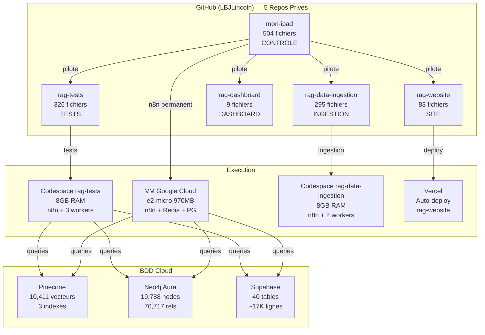
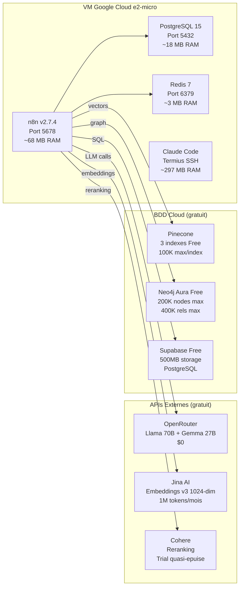
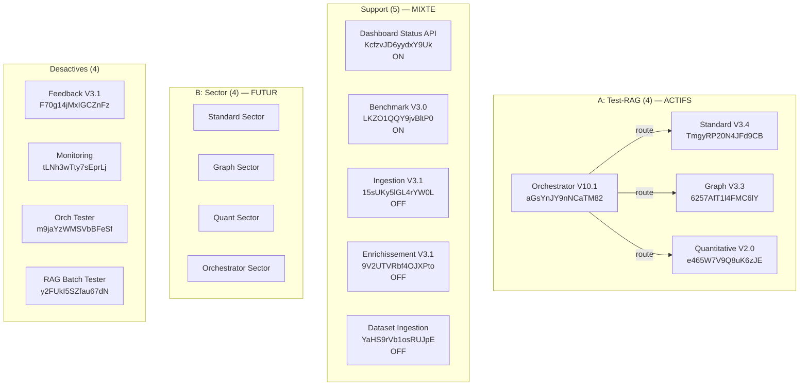

# Inventaire Complet — Multi-RAG Orchestrator

> Last updated: 2026-02-18T19:10:00Z

---

## Vue d'ensemble — 5 Repos

---

## Comptage par Repo (apres specialisation session 20)

### mon-ipad — Tour de Controle (504 fichiers)

| Dossier | Fichiers | Types principaux |
|---------|----------|-----------------|
| `website/` | 107 (sans node_modules) | .tsx (38), .ts (23), .json (10) |
| `logs/` | 247 | .jsonl (32), .json (nombreux) |
| `technicals/` | 16 | .md (15), .json (1) |
| `directives/` | 12 | .md (12) |
| `eval/` | 10 | .py (10) |
| `scripts/` | 20 | .py (12), .sh (8) |
| `n8n/` | 28 | .json (live:9, website:10, analysis:4) |
| `datasets/` | 7 | .json (4), .py (3) |
| `docs/` | 6 | .json (2), .md (3), .html (1) |
| `snapshot/` | 40 | .json (workflows) |
| `mcp/` | 2 | .py (2) |
| `outputs/` | ~5 | .json |
| `infra/` | 7 | .md (7) — NOUVEAU |
| Racine | ~5 | CLAUDE.md, .gitignore, propositions, etc. |
| **TOTAL** | **~504** | |

**Par extension** :
| Extension | Nombre | % |
|-----------|--------|---|
| .json | 327 | 65% |
| .md | 51 | 10% |
| .py | 50 | 10% |
| .jsonl | 32 | 6% |
| .sh | 13 | 3% |
| .tsx | 38 | - |
| .ts | 23 | - |
| Autres | 10 | 2% |

### rag-tests — Tests 4 Pipelines (326 fichiers)

| Dossier | Fichiers | Contenu |
|---------|----------|---------|
| `logs/` | 214 | errors (72), db-snapshots (65), pipeline-results (46), diagnostics (17), iterative-eval (14) |
| `snapshot/` | 50 | workflows (36), good (7), current (4), db (3) |
| `scripts/` | 18 | .py + .sh |
| `.devcontainer/` | 14 | 4 configs (rag-tests, website, dashboard, data-ingestion) |
| `datasets/` | 7 | phase-1 (2), phase-2 (2), scripts (3) |
| `eval/` | 10 | .py |
| `docs/` | 6 | .json, .md, .html |
| `technicals/` | 2 | fixes-library.md, stack.md |
| `directives/` | 2 | workflow-process.md, n8n-endpoints.md |
| `.github/` | 2 | CI workflows |
| Racine | 3 | CLAUDE.md, .gitignore, rag-tests-docker-compose.yml |
| **TOTAL** | **~326** | |

### rag-website — Site Business (83 fichiers)

| Dossier | Fichiers | Contenu |
|---------|----------|---------|
| `website/src/` | 57 | .tsx (38), .ts (19) — composants React |
| `website/public/` | 4 | Images/assets |
| `website/docs/` | 4 | Status data |
| `website/` (config) | 8 | package.json, tsconfig, tailwind, etc. |
| `docs/` | 5 | status.json, data.json, dashboard spec, kimi scripts |
| `.github/` | 2 | CI workflows |
| Racine | 3 | CLAUDE.md, package.json, .gitignore |
| **TOTAL** | **~83** | |

### rag-dashboard — Dashboard Static (9 fichiers)

| Dossier | Fichiers | Contenu |
|---------|----------|---------|
| `docs/` | 6 | status.json, data.json, index.html, dashboard spec, kimi scripts, tested_ids |
| `.github/` | 2 | CI workflows |
| Racine | 2 | CLAUDE.md, .gitignore |
| **TOTAL** | **~9** | |

### rag-data-ingestion — Ingestion Massive (295 fichiers)

| Dossier | Fichiers | Contenu |
|---------|----------|---------|
| `logs/` | 214 | errors (72), db-snapshots (65), pipeline-results (46), diagnostics (17), iterative-eval (14) |
| `n8n/` | 27 | live (13), website (10), analysis (4) |
| `scripts/` | 18 | .py + .sh |
| `datasets/` | 7 | phase-1, phase-2, scripts |
| `docs/` | 6 | .json, .md, .html |
| `technicals/` | 2 | fixes-library.md, sector-datasets.md |
| `.github/` | 2 | CI workflows |
| Racine | 2 | CLAUDE.md, .gitignore |
| **TOTAL** | **~295** | |

---

## Architecture Infrastructure

---

## Workflows n8n — Architecture 9+7 Cible 16

---

## BDD Cloud — Etat Detaille

### Pinecone (3 indexes)

| Index | Vecteurs | Dimension | Namespaces | Usage Free Tier |
|-------|----------|-----------|------------|----------------|
| `sota-rag-jina-1024` | 10,411 | 1024 | 12 | 10.4% (100K max) |
| `sota-rag-cohere-1024` | 10,411 | 1024 | 12 | 10.4% (backup) |
| `sota-rag-phase2-graph` | 1,296 | 1024 | 1 | 1.3% |

### Neo4j Aura Free

| Metrique | Valeur | Limite Free |
|----------|--------|-------------|
| Nodes | 19,788 | 200,000 (9.9%) |
| Relations | 76,717 | 400,000 (19.2%) |
| Top labels | Person (8,531), Entity (8,218), Organization (1,775) |
| Top rels | CONNECTE (75,205) |

### Supabase Free

| Metrique | Valeur | Limite Free |
|----------|--------|-------------|
| Tables | 40 | Illimite |
| Lignes | ~17,000+ | 500MB storage |
| Top tables | benchmark_datasets (9,772), rag_task_executions (1,596), transactions (1,515) |

---

## Ressources Compute

| Environnement | CPU | RAM | Disque | Cout | Usage |
|---------------|-----|-----|--------|------|-------|
| VM GCloud e2-micro | 0.25 vCPU | 970 MB | 30 GB | $0 forever | n8n permanent |
| Codespace rag-tests | 2 cores | 8 GB | 32 GB | $0 (60h/mois) | Tests 50-1000q |
| Codespace rag-data-ingestion | 2 cores | 8 GB | 32 GB | $0 (60h/mois) | Ingestion massive |
| Codespace rag-website | 2 cores | 8 GB | 32 GB | $0 (partage quota) | Dev site |
| Vercel | Serverless | - | - | $0 (Hobby) | Prod website |
| **Total mensuel** | | | | **$0** | |

---

## Fichiers Infrastructure (dans ce dossier `infra/`)

| Fichier | Source | Contenu |
|---------|--------|---------|
| `infrastructure-plan.md` | technicals/ | Plan complet VM, Docker, parallelisation, upgrade |
| `n8n-topology.md` | technicals/ | Topologie n8n distribuee, 3 environnements |
| `stack.md` | technicals/ | Stack technique complete |
| `credentials.md` | technicals/ | Configuration credentials (pas de secrets) |
| `architecture.md` | technicals/ | Architecture 4 pipelines, 16 workflows cible |
| `env-vars-exhaustive.md` | technicals/ | 33 variables d'environnement documentees |
| `inventory.md` | - | CE FICHIER |
| `cloud-alternatives.md` | - | Alternatives cloud gratuites (recherche 2026) |

---

*Genere automatiquement par la session 20 de mon-ipad.*
